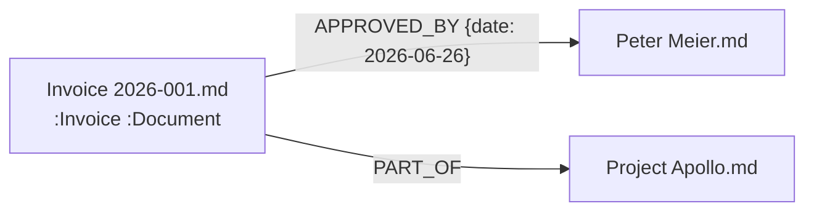

# Property Graph Markdown

**Property Graph Markdown (PGM)** is an open, vendor-neutral proposal for representing openCypher-compatible Property Graphs in CommonMark.

Markdown is evolving from a documentation language into a knowledge representation language for hybrid human-AI systems.

Markdown is already the de facto format for software documentation, knowledge bases, AI agent memory, RAG corpora, and human-maintained notes. It is human-readable, machine-readable, portable, version-control friendly, and token-efficient.

Property Graphs add something Markdown does not have by itself: explicit relationship types, direction, and optional relationship properties. PGM combines these strengths with the smallest possible extension to CommonMark.

PGM is not a Markdown replacement. Every PGM document is still valid CommonMark.

## One-Page Explanation

PGM interprets an ordinary Markdown corpus as a Property Graph:

1. One Markdown file is one graph node.
2. YAML frontmatter defines node labels and node properties.
3. Ordinary CommonMark links define relationships when their visible label contains `->` or `<-`.
4. YAML flow mappings inside semantic link labels define relationship properties.
5. The link destination is canonical. The display label is for humans.

That is the whole core language.

```markdown
---
labels: [Invoice, Document]
status: approved
amount: 1532
currency: CHF
---
# Invoice 2026-001

[APPROVED_BY {date: 2026-06-26} -> Peter Meier](Peter%20Meier.md)
[PART_OF -> Project Apollo](Project%20Apollo.md)
```

The document remains Markdown. Existing editors, renderers, search tools, diff tools, and static site generators continue to work.

## Generated Graph



## Generated openCypher

```cypher
MERGE (n:Invoice:Document {id:"Invoice 2026-001.md"})
SET
    n.status = "approved",
    n.amount = 1532,
    n.currency = "CHF"
MERGE (p {id:"Peter Meier.md"})
MERGE (n)-[:APPROVED_BY {
    date: date("2026-06-26")
}]->(p)
MERGE (q {id:"Project Apollo.md"})
MERGE (n)-[:PART_OF]->(q)
```

## Installation

Clone the repository and install the reference parser dependencies:

```sh
git clone https://github.com/property-graph-markdown/property-graph-markdown.git
cd property-graph-markdown
python -m pip install -r parser/requirements.txt
```

The parser is intentionally small. If `PyYAML` is unavailable, it falls back to a minimal YAML subset for the core examples.

## Parser Usage

Generate openCypher from a Markdown directory:

```sh
python parser/pgmark.py parse examples --cypher
```

Run the tests:

```sh
python -m unittest discover -s tests
```

Use the parser as a library:

```python
from parser.pgmark import parse_corpus, graph_to_cypher

graph = parse_corpus("examples")
print(graph_to_cypher(graph))
```

## Project Layout

```text
SPEC.md              Normative 0.1 draft specification
RATIONALE.md         Design rationale
GRAMMAR.ebnf         Minimal relationship-label grammar
examples/            Small coherent Invoice-Person-Project graph
parser/              Python reference parser
tests/               Parser tests and core cases
obsidian-plugin/     Minimal Obsidian editor integration
```

## Roadmap

PGM 0.1 focuses only on the smallest useful core:

- Core specification
- Reference parser
- Obsidian plugin

Future ideas such as namespaces, ontology validation, RDF export, embedded graph queries, and inference rules are intentionally excluded from 0.1. They can be explored only after the core remains simple, interoperable, and obvious.

## Guiding Principle

Introduce the smallest possible extension to CommonMark that enables Markdown corpora to be interpreted as openCypher-compatible Property Graphs.
