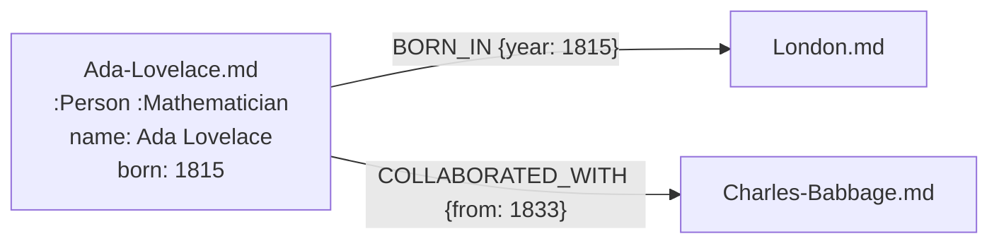

# Property Graph Markdown

**Property Graph Markdown (PGM)** is an open, vendor-neutral proposal for representing openCypher-compatible Property Graphs in CommonMark.

Markdown is evolving from a documentation language into a knowledge representation language for hybrid human-AI systems.

It is already the de facto format for software documentation, knowledge bases, AI agent memory, RAG corpora, and human-maintained notes. Markdown is human-readable, machine-readable, portable, version-control friendly, and token-efficient. Property Graphs add explicit node labels, typed relationships, direction, and properties without giving up those qualities.

PGM is not a Markdown replacement. Every PGM document remains valid CommonMark.

## The Whole Language

PGM adds a semantic interpretation to ordinary CommonMark inline links whose text has this form:

```markdown
[:CLASS {properties}](destination)
```

The destination alone selects the meaning:

```markdown
[:Person {name: "Ada Lovelace"}]()
```

An empty destination annotates the current document node. `Person` is a node label and the flow mapping contains node properties.

```markdown
[:BORN_IN {year: 1815}](London.md)
```

A non-empty destination creates an outgoing relationship. `BORN_IN` is the relationship type and the flow mapping contains relationship properties.

One Markdown file is one node. The file's canonical corpus path is its node identity. Ordinary links remain ordinary links. YAML Front Matter remains ordinary document metadata and has no PGM graph semantics.

That is the complete core language.

## Example

```markdown
---
title: Ada Lovelace
tags:
  - history
---

# Ada Lovelace

[:Person {name: "Ada Lovelace", born: 1815}]()
[:Mathematician]()

Born in [:BORN_IN {year: 1815}](London.md).

Worked with
[:COLLABORATED_WITH {from: 1833}](Charles-Babbage.md).
```

The Front Matter may be useful to an editor or static-site generator, but PGM ignores it. All graph semantics are carried by the four classified links.

## Generated Graph


```mermaid
graph LR
    ada["Ada-Lovelace.md<br/>:Person :Mathematician<br/>name: Ada Lovelace<br/>born: 1815"]
    london["London.md"]
    charles["Charles-Babbage.md"]
    ada -- "BORN_IN {year: 1815}" --> london
    ada -- "COLLABORATED_WITH {from: 1833}" --> charles
```

Equivalent data shape:

```yaml
node:
  id: Ada-Lovelace.md
  labels: [Person, Mathematician]
  properties:
    name: Ada Lovelace
    born: 1815
relationships:
  - type: BORN_IN
    target: London.md
    properties: {year: 1815}
  - type: COLLABORATED_WITH
    target: Charles-Babbage.md
    properties: {from: 1833}
```

## Generated openCypher

```cypher
MERGE (n:Person:Mathematician {id:"Ada-Lovelace.md"})
SET
    n.name = "Ada Lovelace",
    n.born = 1815
MERGE (london {id:"London.md"})
MERGE (charles {id:"Charles-Babbage.md"})
CREATE (n)-[:BORN_IN {year: 1815}]->(london)
CREATE (n)-[:COLLABORATED_WITH {from: 1833}]->(charles)
```

This is the snapshot form. It uses `CREATE` for relationships and assumes an empty relationship target.

PGM identifies a relationship semantically by:

```text
source + type + target + canonical(properties)
```

Property key order and link position do not affect this natural key. Exact duplicate annotations coalesce; the same source, type, and target with different properties remain distinct.

For an idempotent natural-key export into a PGM-owned target, generate `MERGE` relationships instead:

```cypher
MERGE (n)-[:BORN_IN {year: 1815}]->(london)
MERGE (n)-[:COLLABORATED_WITH {from: 1833}]->(charles)
```

PGM does not require a technical relationship ID in Markdown. The reference parser computes a deterministic semantic fingerprint internally, while physical relationship identity remains the graph database's responsibility. A database adapter may materialize that fingerprint as private metadata when its matching or constraint model requires it.

## Validation

Node annotations are cumulative. Labels are deduplicated and equivalent repeated property values are accepted:

```markdown
[:Person {born: 1815}]()
[:Mathematician {born: 1815}]()
```

Conflicting values are errors rather than last-declaration-wins updates:

```markdown
[:Person {born: 1815}]()
[:Mathematician {born: 1816}]()
```

Both `[:Person]()` and `[:Person](<>)` mean the same thing. The first is the canonical form. `[coming soon]()` is still an ordinary empty Markdown link because its text is not a PGM class expression.

## Installation

Clone the repository and install the reference parser dependencies:

```sh
git clone https://github.com/property-graph-markdown/specification.git
cd specification
python -m pip install -r parser/requirements.txt
```

## Parser Usage

Generate openCypher from a Markdown directory:

```sh
python parser/pgmark.py parse examples --cypher
```

The default `create` mode is a snapshot export for an empty relationship target. Use natural-key `MERGE` for idempotent repeated execution:

```sh
python parser/pgmark.py parse examples --cypher --relationship-mode merge
```

`MERGE` does not remove relationships that disappeared from a later source version; that requires database-specific synchronization.

Run the tests:

```sh
python -m unittest discover -s tests
```

Use the parser as a library:

```python
from parser.pgmark import graph_to_cypher, parse_corpus

graph = parse_corpus("examples")
print(graph_to_cypher(graph))
```

## Migration from 0.2.1

PGM 0.3.0 removes graph semantics from YAML Front Matter and removes the reserved `:LABEL` marker.

Previous:

```markdown
---
name: Ada Lovelace
born: 1815
---

[:LABEL](Ontology/Person.md)
[:LABEL](Ontology/Mathematician.md)
```

PGM 0.3.0:

```markdown
[:Person {name: "Ada Lovelace", born: 1815}]()
[:Mathematician]()
```

Existing relationship annotations already use the shared typed-link form and normally require no change.

Earlier prototypes that used Front Matter fields named `labels` or `properties` migrate to the same empty-destination form.

## Project Layout

```text
SPEC.md              Normative 0.3.0 draft specification
RATIONALE.md         Design rationale
GRAMMAR.ebnf         Minimal class-expression grammar
examples/            Small coherent Invoice-Person-Project graph
demo-vault/          Canonical 46-Concept Ada Lovelace demo vault
parser/              Python reference parser
tests/               Parser tests and core cases
obsidian-plugin/     Minimal Obsidian editor integration
```

The Obsidian plugin extracts graph semantics only from CommonMark links. Its wikilink command converts compatible Obsidian authoring syntax to canonical PGM CommonMark before extraction.

## Demo Vault

The [Ada Lovelace Demo Vault](demo-vault/index.md) contains the project's complete 46-Concept PGM 0.4.0 example Knowledge Bundle. Open `demo-vault/` directly in Obsidian or browse the Markdown files on GitHub. The vault is licensed under [CC BY-SA 4.0](demo-vault/ATTRIBUTION.txt).

## Roadmap

PGM 0.3.0 focuses on the unified classified-link core, the reference parser, and the Obsidian integration. Namespaces, ontology validation, RDF export, embedded graph queries, and inference rules remain intentionally outside the core.

## Guiding Principle

Introduce the smallest possible extension to CommonMark that enables Markdown corpora to be interpreted as openCypher-compatible Property Graphs.
