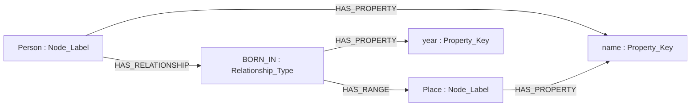

# PGM Schema

This directory is a non-normative, executable example of how Property Graph
Markdown can describe a domain schema and its meta-ontology with Property
Graph Markdown itself. It adds no syntax to the PGM core specification.

Every information-graph node is one Markdown file. An empty-destination PGM
annotation classifies the current node and carries its properties. At M0 this
creates an instance; at M1 and M2* it creates a definition. A non-empty
destination creates a directed relationship between nodes.

## Canonical M2* meta-ontology

The canonical, validated stack contains three levels:

| Level | Purpose | Described by |
| --- | --- | --- |
| M0 | Concrete example data for Ada Lovelace and London | M1 |
| M1 | Example domain schema for people and places | M2* |
| M2* | Reflexively closed PGM meta-ontology | M2* |

M2* is the canonical PGM meta-ontology. It combines the roles formerly split
between M2 and M3. The `Node_Label`
definition is both a classifier and an instance of itself. It is therefore the
fixed point of the typing chain; no M3 level is required for classification
closure.

The mathematical name is “M2*”. The literal directory name contains `*`, so
shell commands should quote it. A future public, cross-platform distribution
may use a portable physical name such as `M2_star` without changing the model
name.

## Total typing function

The seven M2* definitions form this total type function:

```text
type(Node_Label)        = Node_Label
type(Property_Key)      = Node_Label
type(Relationship_Type) = Node_Label
type(identifier)        = Property_Key
type(HAS_PROPERTY)      = Relationship_Type
type(HAS_RELATIONSHIP)  = Relationship_Type
type(HAS_RANGE)         = Relationship_Type
```

The fixed point is [M2*/Node_Label.md](M2*/Node_Label.md):

```markdown
[:Node_Label {identifier: "Node_Label"}]()
```

The label `Node_Label` resolves to the same definition node. Every other M2*
type chain reaches this self-loop.

CommonMark link parsing, the empty/non-empty destination distinction, and the
YAML flow-map value syntax remain external language bootstraps. They are not a
hidden M3 or M4 model.

## M2* vocabulary

- `Node_Label` classifies domain Node Label definitions.
- `Property_Key` classifies domain Property Key definitions.
- `Relationship_Type` classifies directed domain Relationship Type definitions.
- `identifier` binds every definition to its stable PGM identifier.
- `HAS_PROPERTY` assigns a Property Key definition to a Node Label or
  Relationship Type definition.
- `HAS_RELATIONSHIP` assigns a Relationship Type definition to a Node Label
  definition and thereby establishes its Source domain.
- `HAS_RANGE` assigns the Target Node Label to a Relationship Type definition.

M2* expresses association domains through ownership declarations rather than a
separate `DOMAIN` association:

```text
domain(HAS_PROPERTY)     = {Node_Label, Relationship_Type}
range(HAS_PROPERTY)      = Property_Key

domain(HAS_RELATIONSHIP) = {Node_Label}
range(HAS_RELATIONSHIP)  = Relationship_Type

domain(HAS_RANGE)        = {Relationship_Type}
range(HAS_RANGE)         = Node_Label
```

PGM destinations are relative to the source Markdown file. A same-directory
target is therefore `identifier.md`, not `M2*/identifier.md`. M2* contains no
links back to M2 or M3 and is closed under all of its definition relationships.

## Concrete value datatypes

The meta-ontology intentionally has no datatype definition nodes and no
`DATA_TYPE` or `VALUE_TYPE` associations. Concrete PGM values retain the
scalar and recursive list semantics of the embedded YAML flow mapping.

This keeps the fixed point small, but it also means the schema does not assert
global restrictions such as “every `year` value must be numeric.” Such a
constraint would require an additional validation vocabulary outside this
minimal meta-ontology. YAML frontmatter may carry independent documentation or tool
metadata, but it is not needed to type the M2* graph itself.

## Complete M1 example

M1 is a deliberately small but complete domain-schema example. Its five
Markdown nodes exercise all three M2* classifiers and all three M2*
relationship types:

| M1 node | Direct M2* type | Purpose |
| --- | --- | --- |
| `Person` | `Node_Label` | Source node label |
| `Place` | `Node_Label` | Target node label |
| `BORN_IN` | `Relationship_Type` | Directed relationship definition |
| `name` | `Property_Key` | Shared node property definition |
| `year` | `Property_Key` | Relationship property definition |



The complete typing chain for `Person` is:

```text
M1/Person.md       --Node_Label--> M2*/Node_Label.md
M2*/Node_Label.md  --Node_Label--> M2*/Node_Label.md
```

## Complete M0 example

M0 instantiates every definition of the M1 example with two concrete Markdown
nodes:

| M0 node | Direct M1 type | Concrete values and relationships |
| --- | --- | --- |
| `Ada_Lovelace` | `Person` | `name`, `BORN_IN`, and relationship property `year` |
| `London` | `Place` | `name` |

[M0/Ada_Lovelace.md](M0/Ada_Lovelace.md) contains:

```markdown
# Ada Lovelace

Ada Lovelace is a concrete person. [:Person {name: "Ada Lovelace"}]()

Ada Lovelace was born in London in 1815. [:BORN_IN {year: 1815}](London.md)
```

[M0/London.md](M0/London.md) contains:

```markdown
# London

London is a concrete place. [:Place {name: "London"}]()
```

The complete typing chain for Ada Lovelace is:

```text
M0/Ada_Lovelace.md  --Person-----> M1/Person.md
M1/Person.md        --Node_Label-> M2*/Node_Label.md
M2*/Node_Label.md   --Node_Label-> M2*/Node_Label.md
```

The concrete YAML scalars establish that `name` is a string and `year` is a
number without introducing datatype nodes. The `BORN_IN` edge is validated as
`Person → Place`, and its `year` property is declared by the M1 relationship
definition.

## Archived predecessor

The former separate M2/M3 design is preserved outside the active Vault in the
[repository archive](../archive/pgm-schema-m2-m3/README.md). It is historical,
non-canonical, and does not participate in validation or PGM indexing.

## Validation

Run the canonical M0 → M1 → M2* stack:

```sh
npm test
```

The validator checks canonical PGM syntax, resolved relative Markdown targets,
identifier/file binding, the exact total type function, M2* closure and fixed
point, declared properties and relationships, association ranges, M1 schema
structure, and the M0 instance graph. The bundled example currently contains
14 Markdown nodes and 16 directed PGM relationships; further conforming M0 and
M1 nodes are allowed.
